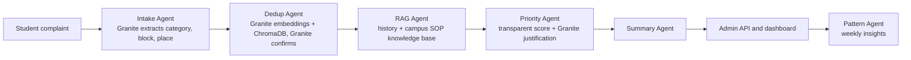

# CampusPulse AI: Campus Problem Intelligence System

Students report the same campus problem in many different ways. CampusPulse AI groups duplicate complaints into one underlying issue, detects location and priority, and gives administrators a prioritized, explainable view (for example, 23 reports become 1 issue). Built for **SDG 11: Sustainable Cities and Communities**.

## Architecture



Every LLM call has retries and a rule-based fallback, so the app still runs if Ollama is down (`MOCK_LLM=1`).

## Setup

```bash
# 1. Granite via Ollama (check exact tags with `ollama list` or the Ollama library)
ollama pull granite3.3:8b
ollama pull granite-embedding:278m

# 2. Backend
python -m venv .venv && source .venv/bin/activate   # Windows: .venv\Scripts\activate
pip install -r requirements.txt
cp .env.example .env        # then export the variables, or set them in your shell
cd backend && uvicorn main:app --reload
```

Open `http://localhost:8000/docs`, call `POST /admin/seed`, then `GET /issues`. The standalone UI prototype is at `http://localhost:8000/app/prototype.html`.

## Endpoints
`POST /complaints` · `GET /issues` · `GET /issues/{id}` · `PATCH /issues/{id}/status` · `GET /analytics/summary` · `GET /insights/weekly` · `POST /admin/seed`

## Priority score (explainable)
`score = 30% safety + 25% report count + 15% time unresolved + 15% recurrence + 15% location importance`. Any electrical or fire hazard is forced to Critical. Thresholds: Critical 60+, High 42+, Medium 25+, else Low.

## Tests
```bash
MOCK_LLM=1 pytest
```

## Status and roadmap
Working: five-agent pipeline, dedup, RAG, priority, summary, pattern insights, REST API, tests, browser prototype (`frontend/prototype.html`, rule-based demo that does not call the API yet).
Next: connect the dashboard to the API, live updates (SSE), Kanban and campus map, admin split/merge corrections, and an evaluation script (dedup F1, priority accuracy, latency) on labeled complaints.

The knowledge base in `agents.py` is sample data; replace it with your college's real SOPs.
